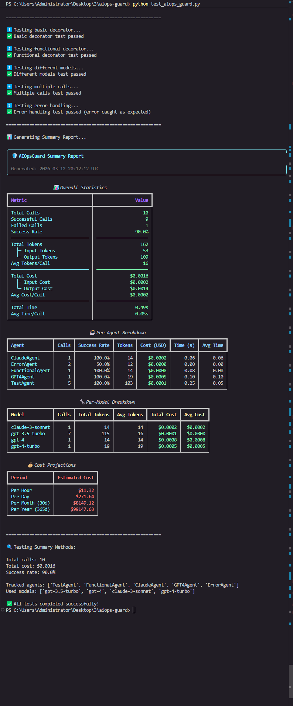

# 📸 Output Examples

## Live Demo



*Complete test execution showing all monitoring features*

---

## Test Execution Output

```
╭──────────────────────────────────────────────────────────────────────────────╮
│ 🛡️  AIOpsGuard Summary Report                                                │
│                                                                              │
│ Generated: 2024-03-11 18:37:59 UTC                                           │
╰──────────────────────────────────────────────────────────────────────────────╯

                  📊 Overall Statistics
┏━━━━━━━━━━━━━━━━━━━━━━━━━━━━━━━━┳━━━━━━━━━━━━━━━━━━━━━━┓
┃ Metric                         ┃                Value ┃
┡━━━━━━━━━━━━━━━━━━━━━━━━━━━━━━━━╇━━━━━━━━━━━━━━━━━━━━━━┩
│ Total Calls                    │                   10 │
│ Successful Calls               │                    9 │
│ Failed Calls                   │                    1 │
│ Success Rate                   │                90.0% │
│ ────────────────────────────── │ ──────────────────── │
│ Total Tokens                   │                  162 │
│   ├─ Input Tokens              │                   53 │
│   └─ Output Tokens             │                  109 │
│ Avg Tokens/Call                │                   16 │
│ ────────────────────────────── │ ──────────────────── │
│ Total Cost                     │              $0.0016 │
│   ├─ Input Cost                │              $0.0002 │
│   └─ Output Cost               │              $0.0014 │
│ Avg Cost/Call                  │              $0.0002 │
│ ────────────────────────────── │ ──────────────────── │
│ Total Time                     │                0.49s │
│ Avg Time/Call                  │                0.05s │
└────────────────────────────────┴──────────────────────┘
```

## Per-Agent Breakdown

```
                             🤖 Per-Agent Breakdown
┏━━━━━━━━━━━━┳━━━━━━━┳━━━━━━━━━━━━━┳━━━━━━━━┳━━━━━━━━━━━━┳━━━━━━━━━━┳━━━━━━━━━━┓
┃            ┃       ┃     Success ┃        ┃            ┃          ┃          ┃
┃ Agent      ┃ Calls ┃        Rate ┃ Tokens ┃ Cost (USD) ┃ Time (s) ┃ Avg Time ┃
┡━━━━━━━━━━━━╇━━━━━━━╇━━━━━━━━━━━━━╇━━━━━━━━╇━━━━━━━━━━━━╇━━━━━━━━━━╇━━━━━━━━━━┩
│ ClaudeAg…  │     1 │      100.0% │     14 │    $0.0002 │     0.06 │     0.06 │
│ ErrorAgent │     2 │       50.0% │     12 │    $0.0000 │     0.00 │     0.00 │
│ Function…  │     1 │      100.0% │     14 │    $0.0008 │     0.08 │     0.08 │
│ GPT4Agent  │     1 │      100.0% │     19 │    $0.0005 │     0.10 │     0.10 │
│ TestAgent  │     5 │      100.0% │    103 │    $0.0001 │     0.25 │     0.05 │
└────────────┴───────┴─────────────┴────────┴────────────┴──────────┴──────────┘
```

## Per-Model Breakdown

```
                            🔧 Per-Model Breakdown
┏━━━━━━━━━━━━━━━━━┳━━━━━━━┳━━━━━━━━━━━━━━┳━━━━━━━━━━━━┳━━━━━━━━━━━━┳━━━━━━━━━━┓
┃ Model           ┃ Calls ┃ Total Tokens ┃ Avg Tokens ┃ Total Cost ┃ Avg Cost ┃
┡━━━━━━━━━━━━━━━━━╇━━━━━━━╇━━━━━━━━━━━━━━╇━━━━━━━━━━━━╇━━━━━━━━━━━━╇━━━━━━━━━━┩
│ claude-3-sonnet │     1 │           14 │         14 │    $0.0002 │  $0.0002 │
│ gpt-3.5-turbo   │     7 │          115 │         16 │    $0.0001 │  $0.0000 │
│ gpt-4           │     1 │           14 │         14 │    $0.0008 │  $0.0008 │
│ gpt-4-turbo     │     1 │           19 │         19 │    $0.0005 │  $0.0005 │
└─────────────────┴───────┴──────────────┴────────────┴────────────┴──────────┘
```

## Cost Projections

```
        💰 Cost Projections
┏━━━━━━━━━━━━━━━━━┳━━━━━━━━━━━━━━━━┓
┃ Period          ┃ Estimated Cost ┃
┡━━━━━━━━━━━━━━━━━╇━━━━━━━━━━━━━━━━┩
│ Per Hour        │         $11.34 │
│ Per Day         │        $272.15 │
│ Per Month (30d) │       $8164.49 │
│ Per Year (365d) │      $99334.66 │
└─────────────────┴────────────────┘
```
